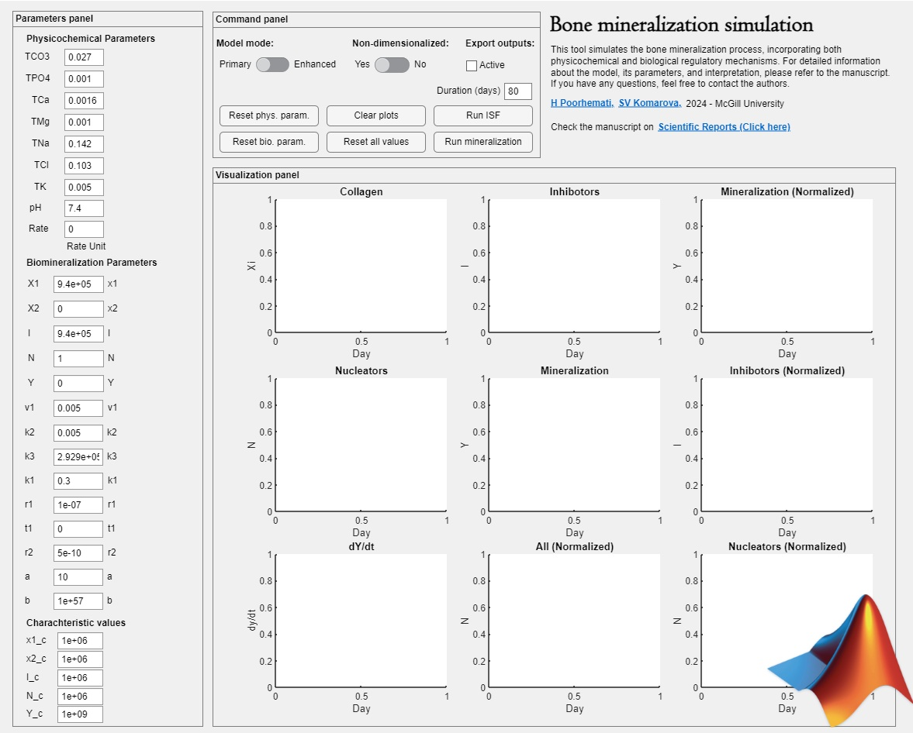

# bone_mineralization_integrated_model
# Mathematical model capturing physicochemical and biological regulation of bone mineralization

This repository contains the MATLAB implementation of the model developed by Hossein Poorhemati, Svetlana Komarova, McGill University - 2024.
The version of MATLAB used for this study was R2023b.

Find the published manuscript at: https://www.nature.com/articles/s41598-024-81472-1

To use the app, download the **"Bone mineralization simulator.mlappinstall"** file. Then, in MATLAB, go to the **Apps** tab, click on **Install App**, and select the downloaded file.

If you use this app in your research or projects, please cite the associated manuscript to acknowledge the work and support its development. Thank you for your support!

If you have any questions please contact: hossein.poorhemati@mail.mcgill.ca

## App screenshot:

